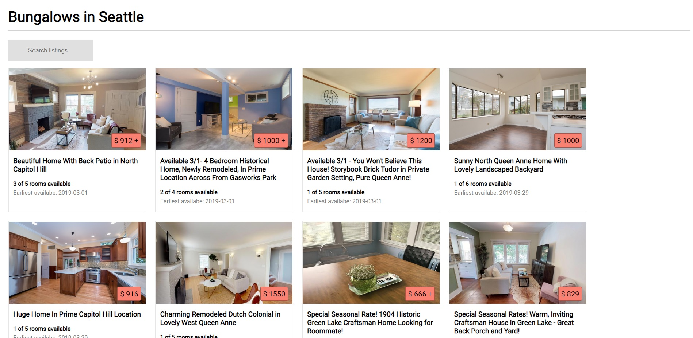

# bungalowChallenge
## Vue project type:
Since the project was relatively small with one or two components, I created the project by including Vue in an index.html file, instead of creating a ‘real-world’ type app through the Vue-CLI.
## Installation:
To run the project, download this repository’s files in a single folder onto your Desktop and open the index.html file in your browser.
## Design choices:
The design is optimized for Google Chrome. I’ve added a screenshot below to show what it looks like on my screen. I focused more on development for this project, but for an actual app in production, I would also focus on responsive design and test on different browsers.

I made the following design choices based on my own preference and looking up other websites (AirBnB and Google hotels in particular). For an app in production, however, I would consult team mates on the UI/UX, do usability tests, and make more data-driven decisions.
-	I stuck with the Bungalow theme as much as possible – Roboto font, white background, black/grey text in the tiles.
-	I added a little more white space around the cards.
-	I made the price stand out a little more, as that’s a big decision factor for me in particular. I picked an orange/pink color for the background to match Bungalow’s logo.
-	For room availability, I used numbers and text instead of circles due to time limitations.
-	To provide a few more details upfront, I added the full headline (instead of forcing it to stay on one line), and added earliest available date.
-	Lastly, due to time limitations, I stuck with displaying the first image in the listings instead of creating a slideshow/carousel.
## Development features:
-	The search bar can filter through headlines in the listings. For example, if you type in ‘beautiful’, only the listings with ‘beautiful’ in the headline will show up.
-	If more than one room is available, the price is shown as $[lowest price]+.
## Other comments:
-	When I first tried to use fetch, I got an error “No 'Access-Control-Allow-Origin' header is present on the requested resource.” I found a way to work around it by using a CORS proxy. [https://stackoverflow.com/questions/43262121/trying-to-use-fetch-and-pass-in-mode-no-cors]
-	In GitHub I have some commits related to a php file. Please ignore those. 
I was originally going to deploy the project as a Heroku app because I like providing links to live projects rather than having someone download files, but when I tried to do so, I realized I ran out of free deploys!  
